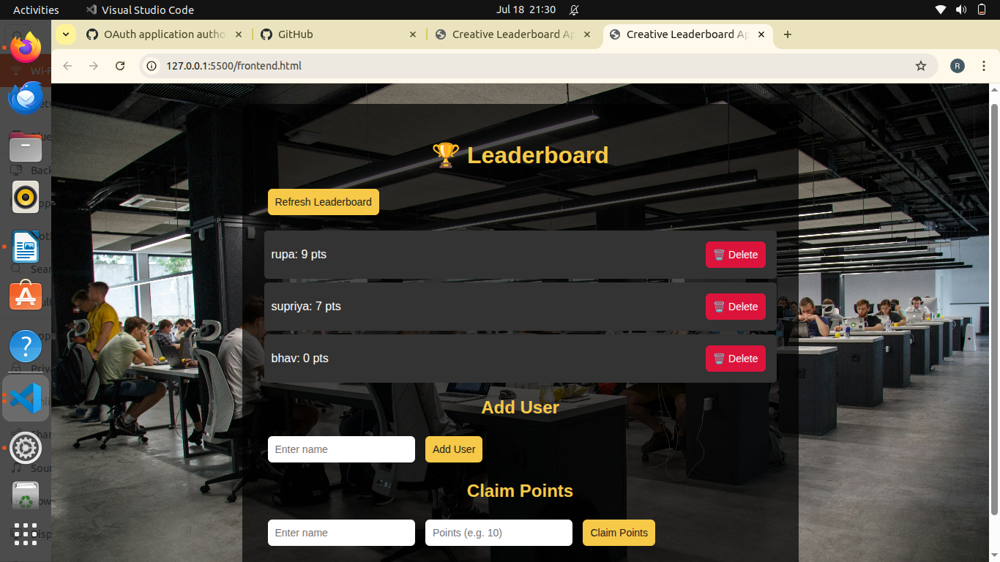
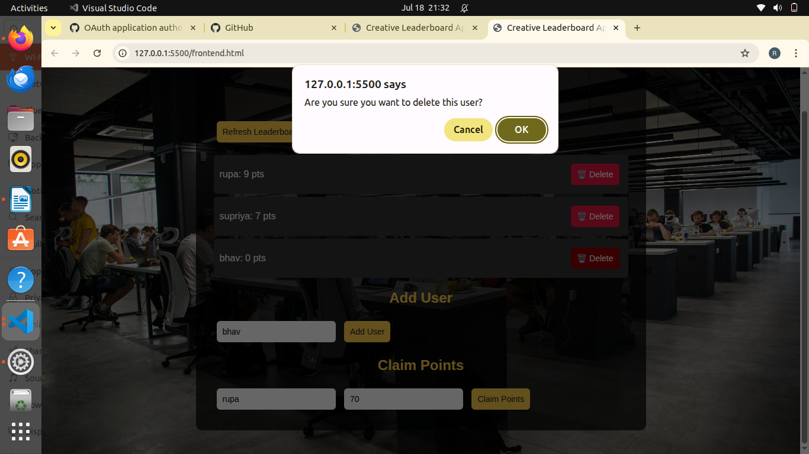

# leaderboard_app
# 🏆 Leaderboard App

A simple and creative **Leaderboard Web App** built using **Node.js, Express, MongoDB, and Vanilla JavaScript (Frontend)**.  
This app allows you to:
- Add new users  
- Claim custom points for each user  
- Delete users  
- View a leaderboard sorted by points  
- Track claim history  

---

## 🚀 Features
- **Add User**: Create new users with names.  
- **Claim Points**: Assign any number of points to a user.  
- **Delete User**: Remove a user permanently from the leaderboard.  
- **Leaderboard**: Displays users ranked by total points.  
- **Creative UI**: Stylish frontend with background image & modern design.  

---

## 🛠️ Tech Stack
- **Backend**: Node.js + Express  
- **Database**: MongoDB (Atlas or local)  
- **Frontend**: HTML, CSS, JavaScript (fetch API)  

---

## 📂 Project Structure

leaderboard-app/
├── backend/
│ ├── models/
│ │ ├── User.js
│ │ └── ClaimHistory.js
│ ├── controllers/
│ │ └── userController.js
│ ├── routes/
│ │ └── userRoutes.js
│ ├── server.js
│ └── config/
│ └── db.js
├── frontend/
│ └── index.html
└── README.md

2️⃣ Install Dependencies
cd backend
npm install

3️⃣ Setup MongoDB

Create a MongoDB Atlas cluster or run MongoDB locally.

Add your connection string in config/db.js.
const mongoose = require('mongoose');

const connectDB = async () => {
  try {
    await mongoose.connect('YOUR_MONGODB_URI', {
      useNewUrlParser: true,
      useUnifiedTopology: true
    });
    console.log('MongoDB connected');
  } catch (err) {
    console.error(err.message);
    process.exit(1);
  }
};

module.exports = connectDB;

4️⃣ Run Backend

node server.js
Backend runs at: http://localhost:5000

5️⃣ Run Frontend

Open frontend/index.html directly in your browser.

Or serve it using VS Code Live Server.
🌐 API Endpoints
Users

POST /api/users → Create user

GET /api/users → Get all users (sorted by points)

DELETE /api/users/:id → Delete user

Points

POST /api/claim → Claim points for a user

History

GET /api/history → Get claim history

🎨 Screenshots

### Adding Users

###Deleting Users

###Adding Points

💡 Future Improvements

Add authentication (login/signup).

Add categories or teams.

Responsive mobile-friendly design.

Export leaderboard to CSV/PDF.

👨‍💻 Author

Developed by CHENNA RUPA SREE 🚀
